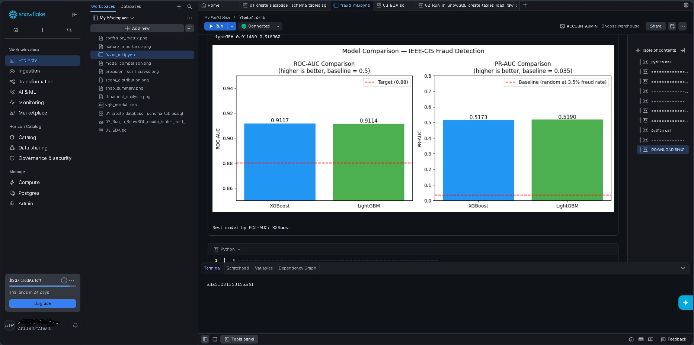
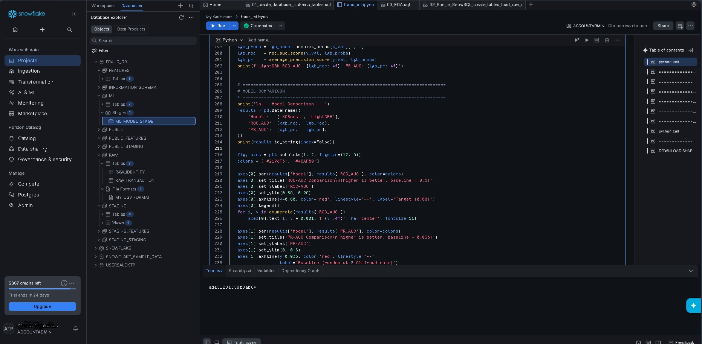
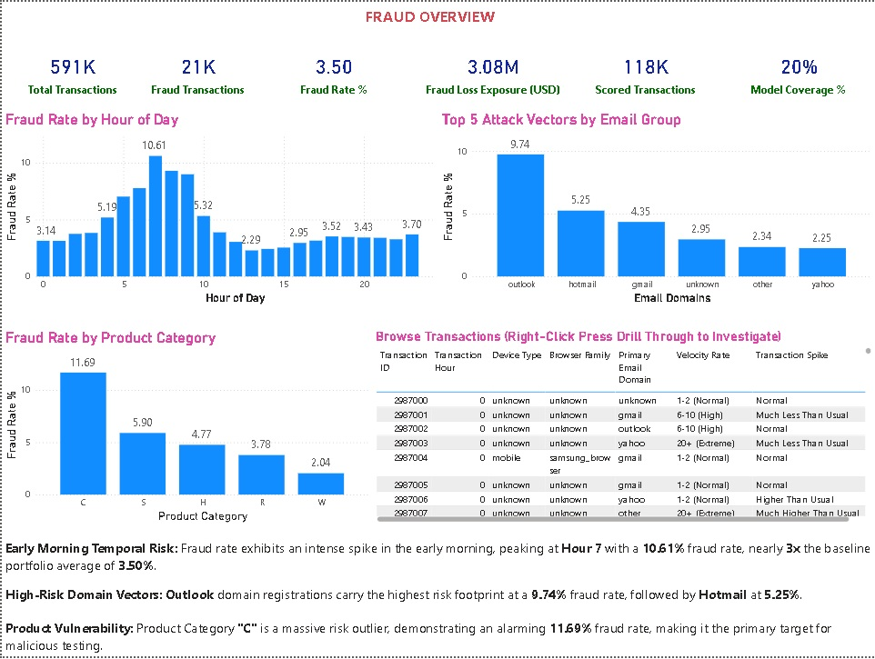
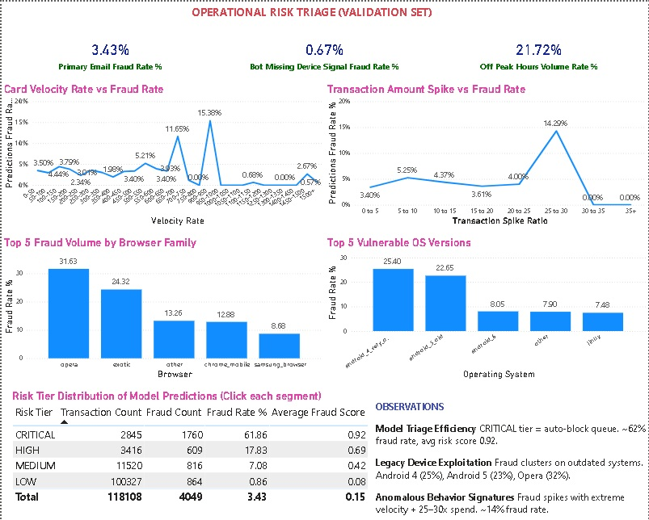
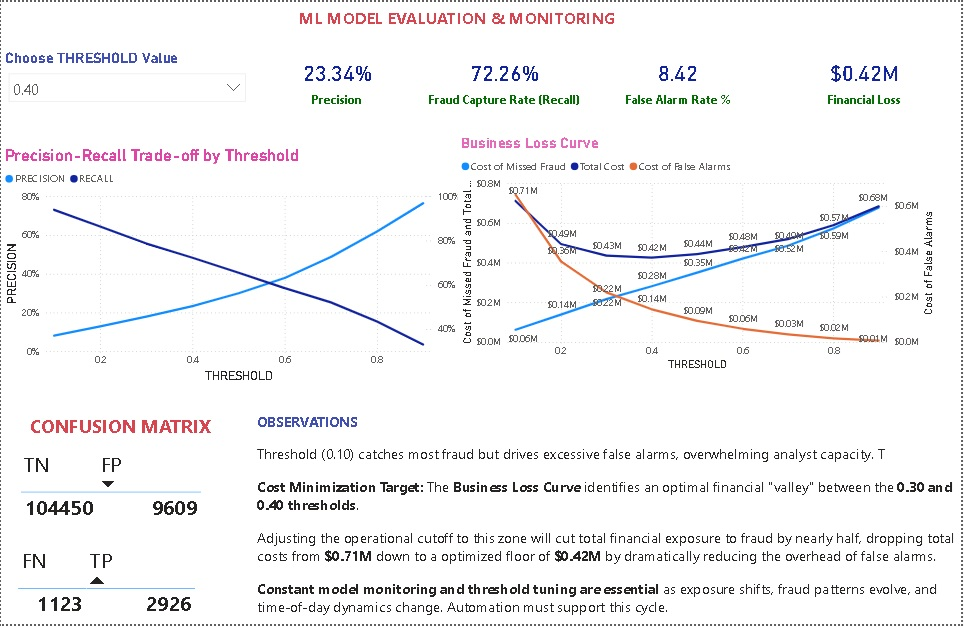
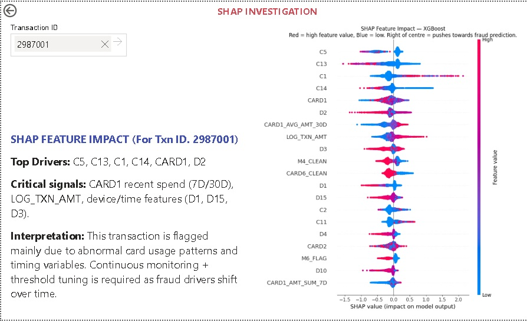
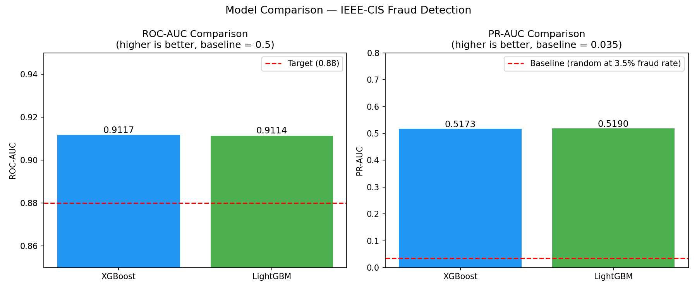
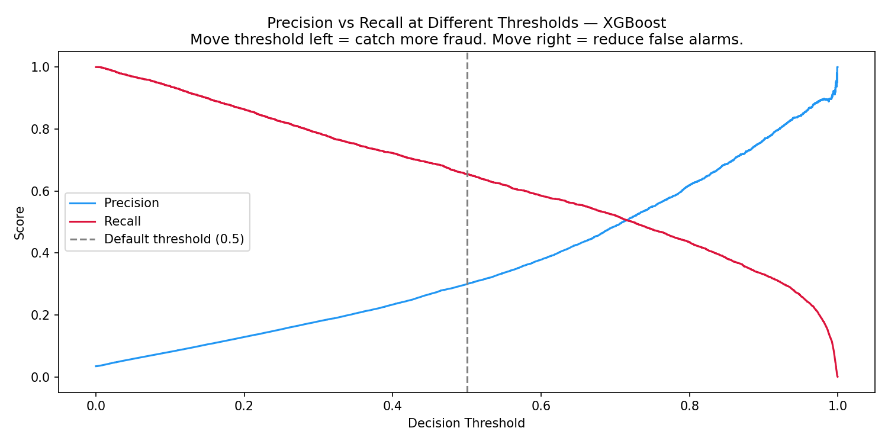
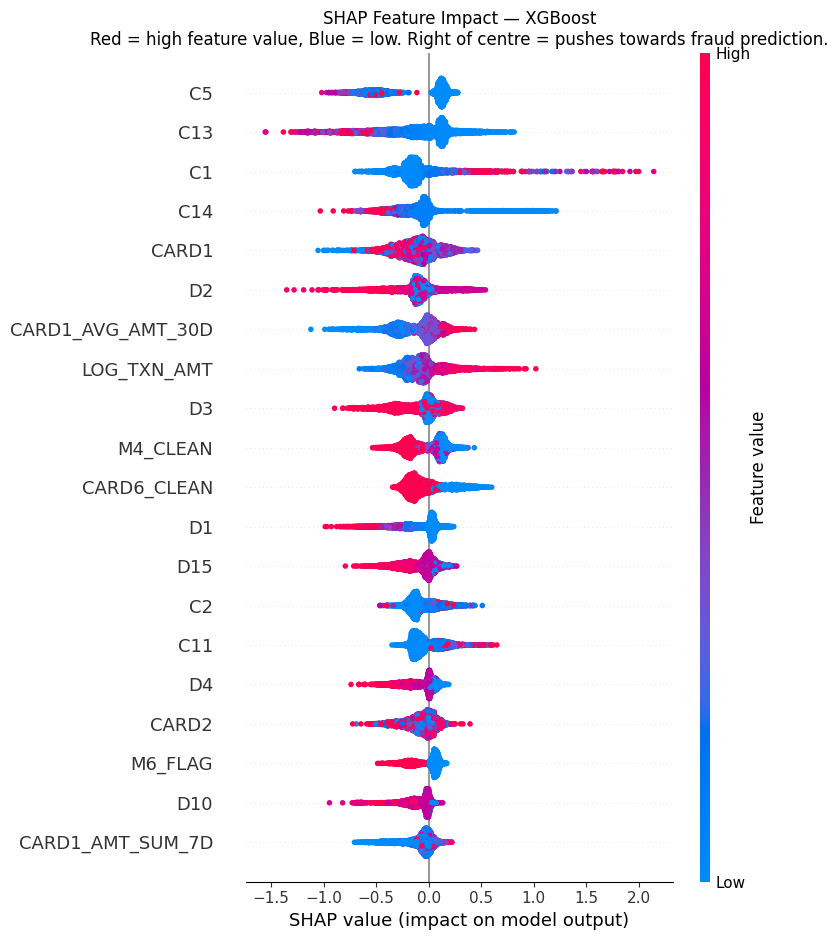

# Enterprise Fraud Detection & Risk Optimization Platform

## Case Study

How can a financial platform:
* Track total fraud loss exposure across high-volume transactions?
* Identify high-risk behavioral anomalies and velocity spikes?
* Optimize model decision thresholds to minimize net business costs?
* Provide transparent, explainable risk vectors for fraud investigators?

---

## About the Dataset (IEEE-CIS Fraud Detection)

This project utilizes the industry-standard IEEE-CIS dataset, containing real-world, highly dimensional e-commerce transactional logs.
* ~591,000 transactions
* Identity & device network attributes
* Card & aggregate behavioral variables
* Severe class imbalance (~3.5% fraud baseline)

### Data Coverage:
* Transaction amounts, timings, and product types
* Device categories, browser versions, and OS groups
* Card profile characteristics and relational metadata

---

## Project Architecture

Snowflake (Raw -> Staging)
↓
dbt (Feature Engineering + Quality Testing)
↓
Machine Learning (XGBoost vs. LightGBM Production Core)
↓
Power BI Dashboard (Operational Triage Suite)


---



## Tech Stack

* **Snowflake:** Cloud data warehousing and compute
* **dbt (Data Build Tool):** DAG transformation, modeling, and testing
* **Python:** Scikit-learn, XGBoost, LightGBM, SHAP, Matplotlib
* **Power BI:** Multi-page interactive executive and forensic reporting suite

---

## DASHBOARDS (BUSINESS-FIRST APPROACH)

### 1️⃣ Fraud Overview (Executive Cockpit)



**Key Observations:**
* Total loss exposure identified at **$3.08M** with 591K processed transactions
* Portfolio baseline fraud rate sits at **3.50%**
* Hourly risk profiling reveals an operational fraud spike (**10.61%**) at Hour 7
* Email risk analysis flags **Outlook** domain as a primary vector at **9.74%**
* Product vulnerability maps highlight **Product Type C** as a high-risk outlier (**11.69%**)

### 2️⃣ Operational Risk Triage (Manager Dashboard)



**Key Observations:**
* Tracks off-peak hourly volumes (**21.72%**) linked to automated script patterns
* Flags browser risk, showing extreme vulnerability on legacy environments (**Opera at 31.63%**)
* Pinpoints high fraud correlation with legacy, budget Android devices
* Automated **Critical Risk Queue** isolates 2,845 cases with a **61.86% fraud density**
* Enables immediate auto-blocking rules for the highest tier, saving analyst overhead

### 3️⃣ ML Model Evaluation & Monitoring (Data Science Control)



**Key Observations:**
* Provides live simulation of precision, recall, and false alarm interactions
* Replaces default 0.50 cutoff with an optimized business utility metric
* Identifies a financial **"Cost Valley" between 0.30 and 0.40** decision thresholds
* Minimizes combined costs of missed fraud and false customer friction
* Lowers total net business loss from **$0.71M down to a floor of $0.42M**

### 4️⃣ SHAP Forensic Investigation (Analyst Workspace)



**Key Observations:**
* Single-transaction isolation driven by cross-page drill-through actions
* Generates localized behavioral anomaly charts using asset metadata weights
* Translates complex model parameters into digestible root-cause indicators
* Highlights specific risk drivers (e.g., velocity spikes, extreme value deviations)
* Eliminates "black box" friction, speeding up operational queue clear times

---

## MACHINE LEARNING — FRAUD MODEL

### Models Used
* LightGBM (Baseline comparison)
* XGBoost (Final Production Model)

### Model Performance Metrics



* **XGBoost Performance:** ROC-AUC: **0.9117** | PR-AUC: **0.5173**
* **LightGBM Performance:** ROC-AUC: **0.9114** | PR-AUC: **0.5190**
* Formulated to handle massive data dimensions and native missing values effectively.

### Cost Optimization Curve



* Maps financial impacts across the entire probability continuum
* Proves that tracking raw accuracy fails business goals compared to balancing financial cost-weights

### Global Feature Importance (SHAP)



**Key Drivers of Global Fraud:**
* Count-based network attributes (`C5`, `C13`, `C1`)
* Target time gaps and transactional velocity spans (`D2`)
* Engineered aggregates (Card spending velocities, ratios, and value log-scales)

---

## DATA LINEAGE (DBT DAG)

### Full Pipeline Lineage


### Data Modelling Approach
* **Staging Layer:** Initial ingest, column typing, and raw flag casting
* **Intermediate Layer:** Identity-to-transaction key matching and temporal tracking
* **Marts Layer (`FEAT_FINAL`):** Materializes rolling window counts and velocity ratios for ML training
* **Data Quality Assurances:** Automated schema testing, including uniqueness enforcements and null-injection blocks

---

## MAIN INSIGHTS

### Operations
* Flags critical fraud windows (Hour 7 spikes) to dynamically scale review team capacity.
* Identifies clear network and device vulnerabilities to intercept script attacks.

### Risk Management
* Isolates a tiny subset of critical accounts driving over 60% of verified fraud exposure.
* Implements precise auto-block parameters without disrupting normal user lifecycles.

### Cost Savings
* Shifts the decision threshold to reduce net operational exposure by **$290,000**.
* Balances chargeback fees against user friction systematically.

### Decision Making
* Integrates data engineering pipelines with live machine learning tracing and visual business layers.

---

## WHAT THIS PROJECT SHOWS

1. Abstract model accuracy does not equal business value; optimizing the financial cost curve is what saves capital.
2. Behavioral velocity metrics (how fast an account spins) are far more predictive than raw transaction values.
3. Machine learning models must remain explainable at the analyst level to be successful in live production environments.

---

## WHAT SHOULD BE DONE (BUSINESS ACTIONS)

* Deploy automated auto-blocking directly to transactions falling in the 0.92+ model score bucket.
* Update routing rules to prompt multi-factor authentication (MFA) for transactions originating from high-risk legacy OS/Browser clusters.
* Permanently recalibrate the platform's classification threshold to **0.34** to maintain the absolute floor of business loss.
* Use the Page 4 forensic trace tool to audit complex fraud edge-cases and fulfill compliance reporting.

---

## FINAL OUTCOME

This project demonstrates how an end-to-end cloud platform can:
* Transform raw transactional log files into trusted data products
* Engine robust feature pipelines via dbt and Snowflake
* Run production-grade machine learning models to maximize utility
* Deliver intuitive, actionable analytics straight to business operators

---

## HOW TO RUN

1. Execute source setup scripts in Snowflake to initialize raw tables.
2. Run the dbt engineering repository:
   ```bash
   dbt run
   dbt test
Run the machine learning model script (best_model.pkl) to capture feature weights.

Open the Power BI desktop suite, adjust source strings to match your data warehouse endpoint, and refresh your tables.

AUTHOR
Alok T P
